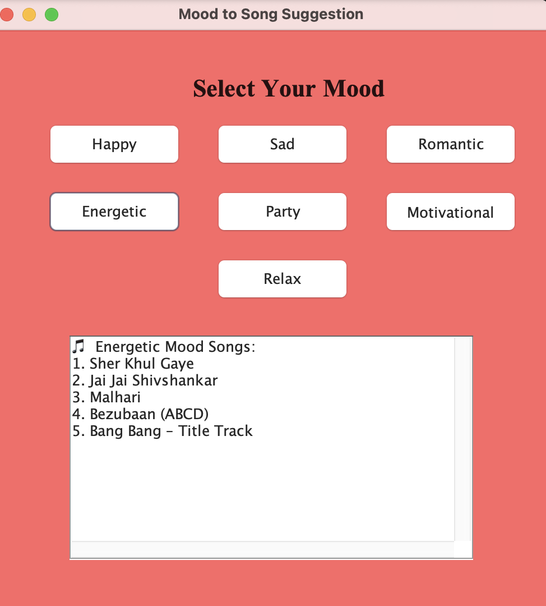

# Mood To Song 🎵

A simple Java GUI project that suggests songs based on the user's mood.

This project is built using Java AWT (Abstract Window Toolkit). Users can select different moods using buttons, and the application displays recommended songs for that mood.

---

## Features ✨

- Mood-based song suggestions
- Simple and interactive GUI
- Different background colors for each mood
- Multiple mood categories:
  - Happy
  - Sad
  - Romantic
  - Energetic
  - Party
  - Motivational
  - Relax / Chill

---

## Technologies Used 💻

- Java
- AWT (Abstract Window Toolkit)

---

## How to Run ▶️

### 1. Clone the repository

```bash
git clone https://github.com/harshika-agrawal/mood-to-song.git
```

### 2. Compile the program

```bash
javac Song.java
```

### 3. Run the program

```bash
java Song
```

---

## Project Screenshot 📸



---

## Author 👩‍💻

Harshika Agrawal

---

## Purpose of Project 🎯

This project was created to practice:
- Java GUI programming
- Event handling
- Buttons and layouts
- User interaction using Java AWT
